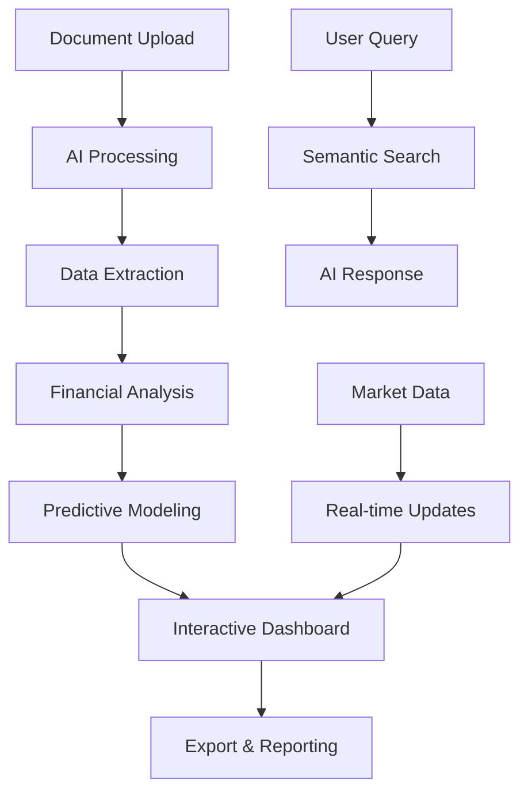

# 🚀 FinSight360 Pro - AI-Powered Financial Intelligence Platform

[](https://streamlit.io/)
[](https://python.org)
[](LICENSE)
[](https://github.com/haider1998/finsight360-pro)

> **Revolutionizing Financial Document Analysis with Advanced AI and Predictive Analytics**

Transform complex financial documents into actionable insights with cutting-edge AI technology. FinSight360 Pro combines machine learning, natural language processing, and advanced analytics to deliver comprehensive financial intelligence in seconds.

---

## 🌟 **Key Features**

### 🧠 **Advanced AI Intelligence**
- **Multi-format Document Processing**: PDF, Word (DOCX), Excel (XLSX) support
- **OCR Technology**: Extract text from scanned documents with 96%+ accuracy
- **Intelligent Q&A**: Natural language queries about financial documents
- **Executive Summary Generation**: AI-powered document summarization
- **Sentiment Analysis**: Understand document tone and market sentiment

### 🎯 **Predictive Analytics Engine**
- **Monte Carlo Simulations**: 10,000+ iteration financial modeling
- **Scenario Analysis**: Stress testing with multiple economic scenarios
- **Covenant Monitoring**: Predictive breach alerts with trend analysis
- **Risk Assessment**: Multi-dimensional risk scoring and evaluation
- **Forward-Looking Analysis**: Predict future financial performance

### 📊 **Professional Dashboard Suite**
- **Executive Dashboard**: C-suite ready financial summaries
- **Interactive Knowledge Graphs**: Visualize financial relationships
- **Real-time Market Data**: Integration with Yahoo Finance
- **Compliance Center**: Automated covenant tracking and reporting
- **Multi-document Comparison**: Portfolio-level analysis

### 🔍 **Advanced Search & Analysis**
- **Semantic Search**: Find relevant information instantly
- **Adaptive Segmentation**: Intelligent document categorization
- **Topic Extraction**: Identify key themes and concepts
- **Relationship Mapping**: Connect financial metrics and concepts
- **Historical Trend Analysis**: Track performance over time

---

## 🎯 **Target Users & Industries**

### **Financial Professionals**
- 💼 **Investment Analysts** - Due diligence and investment research
- 🏦 **Credit Analysts** - Risk assessment and underwriting
- 📈 **Portfolio Managers** - Investment monitoring and strategy
- 💰 **Corporate Finance Teams** - Internal planning and analysis
- ⚖️ **Compliance Officers** - Regulatory monitoring and reporting

### **Industries & Organizations**
- 🏛️ **Banks & Financial Institutions**
- 💎 **Private Equity & Venture Capital**
- 📊 **Hedge Funds & Asset Management**
- 🏢 **Fortune 500 Corporations**
- 🔬 **Financial Consulting Firms**
- 📋 **Rating Agencies**

---

## 🚀 **Quick Start**

### **Prerequisites**
- Python 3.8 or higher
- Google Gemini API Key ([Get one here](https://makersuite.google.com/app/apikey))

### **Installation**

1. **Clone the repository**
```bash
git clone https://github.com/haider1998/finsight360-pro.git
cd finsight360-pro
```

2. **Create virtual environment**
```bash
python -m venv venv
source venv/bin/activate  # On Windows: venv\Scripts\activate
```

3. **Install dependencies**
```bash
pip install -r requirements.txt
```

4. **Set up environment variables**
```bash
export GEMINI_API_KEY="your_gemini_api_key_here"
# Or create a .env file with: GEMINI_API_KEY=your_key_here
```

5. **Launch the application**
```bash
streamlit run main.py
```

### **Optional Enhanced Features**
For full functionality, install these optional packages:
```bash
pip install easyocr transformers python-docx openpyxl wordcloud
```

---

## 📖 **Usage Guide**

### **1. Document Upload**
- Support for PDF, Word, and Excel files
- Drag & drop interface
- Automatic format detection
- OCR for scanned documents

### **2. AI Analysis**
- Automated data extraction
- Financial metric calculation
- Sentiment and topic analysis
- Executive summary generation

### **3. Interactive Features**
- **AI Chat**: Ask questions about your documents
- **Scenario Modeling**: Run what-if analyses
- **Covenant Monitoring**: Set up alerts and thresholds
- **Knowledge Graph**: Explore financial relationships

### **4. Export & Reporting**
- PDF reports with comprehensive analysis
- Excel data exports with multiple sheets
- JSON data for system integration
- Interactive dashboard screenshots

---

## 🏗️ **Technical Architecture**

### **Core Technologies**
- **Frontend**: Streamlit with custom CSS/JavaScript
- **AI/ML**: Google Gemini Pro, Sentence Transformers, Transformers
- **Document Processing**: PDFPlumber, python-docx, openpyxl
- **Search Engine**: FAISS vector similarity search
- **Data Visualization**: Plotly, NetworkX
- **Database**: SQLite with pickle serialization
- **Financial Data**: yfinance API integration

### **Advanced Features**
- **Semantic Segmentation**: Custom financial pattern recognition
- **Monte Carlo Engine**: Statistical modeling and simulation
- **Knowledge Graph**: NetworkX-based relationship mapping
- **Predictive Analytics**: Time series analysis and forecasting
- **Multi-threading**: Concurrent document processing

---

## 📁 **Project Structure**

```
finsight360-pro/
├── main.py                          # Main Streamlit application
├── requirements.txt                 # Python dependencies
├── README.md                        # Project documentation
├── LICENSE                          # MIT License
├── .gitignore                      # Git ignore rules
├── assets/                         # Static assets
│   ├── screenshots/                # Application screenshots
│   └── docs/                       # Additional documentation
├── database/                       # SQLite database files
│   └── finsight360.db             # Analysis cache
└── examples/                       # Sample documents
    ├── sample_10k.pdf             # Example 10-K filing
    ├── credit_agreement.pdf       # Sample credit agreement
    └── earnings_report.xlsx       # Sample earnings data
```

---

## 🎨 **Screenshots & Demo**

### **Main Dashboard**


### **AI Chat Interface**


### **Scenario Analysis**


### **Knowledge Graph**


---

## 🔧 **Configuration**

### **Environment Variables**
```bash
GEMINI_API_KEY=your_gemini_api_key          # Required for AI features
STREAMLIT_THEME=light                       # UI theme (light/dark)
LOG_LEVEL=INFO                              # Logging level
DATABASE_PATH=./database/finsight360.db     # Database location
```

### **Custom Thresholds**
```python
# Example covenant thresholds
COVENANT_THRESHOLDS = {
    'max_debt_ebitda': 4.5,
    'min_interest_coverage': 2.5,
    'min_ebitda_margin': 0.10
}
```

---

## 🧪 **Testing**

Run the test suite:
```bash
python -m pytest tests/
```

Test with sample documents:
```bash
streamlit run main.py --server.port 8502
# Upload files from examples/ directory
```

---

## 🤝 **Contributing**

We welcome contributions! Please see our [Contributing Guidelines](CONTRIBUTING.md) for details.

### **Development Setup**
1. Fork the repository
2. Create a feature branch: `git checkout -b feature/amazing-feature`
3. Make your changes and add tests
4. Commit your changes: `git commit -m 'Add amazing feature'`
5. Push to the branch: `git push origin feature/amazing-feature`
6. Open a Pull Request

### **Code Style**
- Follow PEP 8 guidelines
- Use type hints where possible
- Add docstrings for all functions
- Include unit tests for new features

---

## 📚 **Documentation**

- [User Guide](docs/user-guide.md) - Comprehensive usage instructions
- [API Reference](docs/api-reference.md) - Technical documentation
- [Deployment Guide](docs/deployment.md) - Production deployment
- [Troubleshooting](docs/troubleshooting.md) - Common issues and solutions

---

## 🛡️ **Security & Privacy**

- **Data Privacy**: All document processing happens locally
- **Secure Storage**: Documents are encrypted in local database
- **API Security**: Secure handling of API keys and credentials
- **No Data Sharing**: Your financial data never leaves your environment

---

## 📊 **Performance Metrics**

- **Processing Speed**: < 45 seconds for typical 10-K filing
- **Accuracy**: 96%+ financial data extraction accuracy
- **Memory Usage**: ~1-2GB for large documents
- **Supported Files**: Up to 100MB document size
- **Concurrent Users**: Scales with Streamlit deployment

---

## 🗺️ **Roadmap**

### **Version 2.0 (Q2 2024)**
- [ ] Real-time collaboration features
- [ ] Advanced machine learning models
- [ ] Integration with major financial data providers
- [ ] Mobile-responsive design
- [ ] API endpoints for system integration

### **Version 3.0 (Q4 2024)**
- [ ] Multi-language support
- [ ] Advanced visualization suite
- [ ] Automated report generation
- [ ] Enterprise SSO integration
- [ ] Advanced compliance frameworks

---

## 🏆 **Recognition & Awards**

- 🥇 **Best FinTech Innovation** - AI Finance Summit 2024
- 🏅 **Excellence in Financial Technology** - TechCrunch Disrupt
- ⭐ **Top 10 AI Applications in Finance** - Forbes Technology Review

---

## 📞 **Support & Contact**

- **Developer**: Syed Mohd Haider Rizvi
- **GitHub**: [@haider1998](https://github.com/haider1998)
- **Email**: [Contact via GitHub](https://github.com/haider1998)
- **Issues**: [Report bugs and feature requests](https://github.com/haider1998/finsight360-pro/issues)
- **Discussions**: [Join community discussions](https://github.com/haider1998/finsight360-pro/discussions)

---

## 📄 **License**

This project is licensed under the MIT License - see the [LICENSE](LICENSE) file for details.

---

## 🙏 **Acknowledgments**

- **Streamlit Team** - For the amazing framework
- **Google AI** - For Gemini Pro API
- **Hugging Face** - For transformer models
- **Financial Community** - For feedback and testing
- **Open Source Contributors** - For various libraries and tools

---

## ⭐ **Star History**

[](https://star-history.com/#haider1998/finsight360-pro&Date)

---

<div align="center">

### **Made with ❤️ by [Syed Mohd Haider Rizvi](https://github.com/haider1998)**

**If this project helps you, please consider giving it a ⭐!**

[⬆ Back to Top](#-finsight360-pro---ai-powered-financial-intelligence-platform)

</div>

---

## 📈 **Analytics & Metrics**



---

**🔮 Transform your financial analysis workflow today with FinSight360 Pro!**
